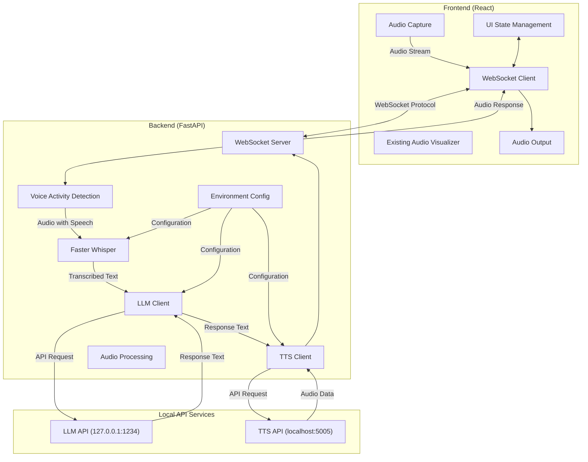
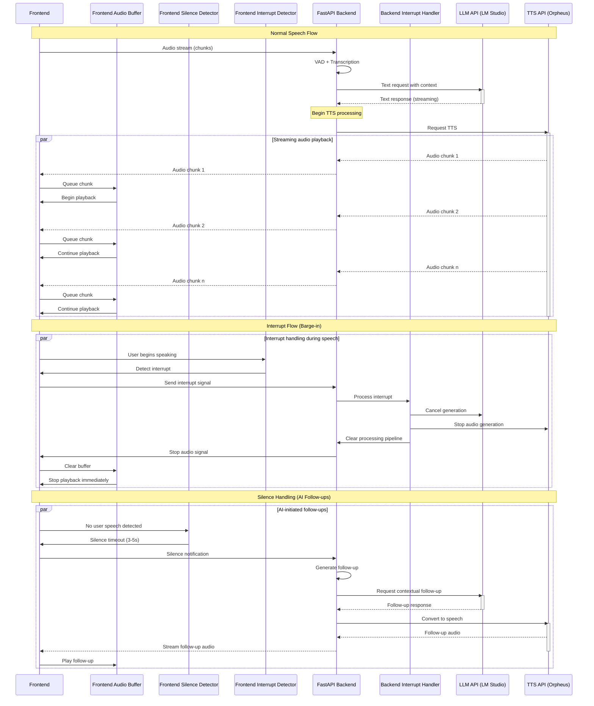

# Vocalis

[](https://opensource.org/licenses/MIT)
[](https://reactjs.org/)
[](https://fastapi.tiangolo.com/)
[](https://github.com/guillaumekln/faster-whisper)
[](https://www.python.org/)

A sophisticated AI assistant with speech-to-speech capabilities built on a modern React frontend with a FastAPI backend. Vocalis provides a responsive, low-latency conversational experience with advanced visual feedback.

## Changelog

**v1.0.0** (Initial Release) - March 31, 2025
- ✨ Revolutionary barge-in technology for natural conversation flow
- 🔊 Ultra low-latency audio streaming with adaptive buffering
- 🤖 AI-initiated greetings and follow-ups for natural conversations
- 🎨 Dynamic visual feedback system with state-aware animations
- 🔄 Streaming TTS with chunk-based delivery for immediate responses
- 🚀 Cross-platform support with optimized setup scripts
- 💻 CUDA acceleration with fallback for CPU-only systems

## Features

### 🎯 Advanced Conversation Capabilities

- **🗣️ Barge-In Interruption** - Interrupt the AI mid-speech for a truly natural conversation experience
- **👋 AI-Initiated Greetings** - Assistant automatically welcomes users with a contextual greeting
- **💬 Intelligent Follow-Ups** - System detects silence and continues conversation with natural follow-up questions
- **🔄 Conversation Memory** - Maintains context throughout the conversation session
- **🧠 Contextual Understanding** - Processes conversation history for coherent, relevant responses

### ⚡ Ultra-Responsive Performance

- **⏱️ Low-Latency Processing** - End-to-end latency under 500ms for immediate response perception
- **🔊 Streaming Audio** - Begin playback before full response is generated
- **📦 Adaptive Buffering** - Dynamically adjust audio buffer size based on network conditions
- **🔌 Efficient WebSocket Protocol** - Bidirectional real-time audio streaming
- **🔄 Parallel Processing** - Multi-stage pipeline for concurrent audio handling

### 🎨 Interactive Visual Experience

- **🔮 Dynamic Assistant Orb** - Visual representation with state-aware animations:
  - Pulsing glow during listening
  - Particle animations during processing
  - Wave-like motion during speaking
- **📝 Live Transcription** - Real-time display of recognized speech
- **🚦 Status Indicators** - Clear visual cues for system state
- **🌈 Smooth Transitions** - Fluid state changes with appealing animations
- **🌙 Dark Theme** - Eye-friendly interface with cosmic aesthetic

### 🛠️ Technical Excellence

- **🔍 High-Accuracy VAD** - Superior voice activity detection using Silero VAD
- **🗣️ Optimized Whisper Integration** - Faster-Whisper for rapid transcription
- **🔊 Real-Time TTS** - Chunked audio delivery for immediate playback
- **🖥️ Hardware Flexibility** - CUDA acceleration with CPU fallback options
- **🔧 Easy Configuration** - Environment variables and user-friendly setup

## Quick Start

### One-Click Setup (Recommended)

### Windows
1. Run `setup.bat` to initialize the project (one-time setup)
   - Includes option for CUDA or CPU-only PyTorch installation
2. Run `run.bat` to start both frontend and backend servers
3. If you need to update dependencies later, use `install-deps.bat`

### macOS/Linux
1. Make scripts executable: `chmod +x *.sh`
2. Run `./setup.sh` to initialize the project (one-time setup)
   - Includes option for CUDA or CPU-only PyTorch installation
3. Run `./run.sh` to start both frontend and backend servers
4. If you need to update dependencies later, use `./install-deps.sh`

### Manual Setup (Alternative)

If you prefer to set up the project manually, follow these steps:

#### Backend Setup
1. Create a Python virtual environment:
   ```bash
   cd backend
   python -m venv env
   # Windows:
   .\env\Scripts\activate
   # macOS/Linux:
   source env/bin/activate
   ```

2. Install the Python dependencies:
   ```bash
   pip install -r requirements.txt
   ```

3. If you need CUDA support, install PyTorch with CUDA:
   ```bash
   pip install torch torchvision torchaudio --index-url https://download.pytorch.org/whl/cu124
   ```

4. Start the backend server:
   ```bash
   python -m backend.main
   ```

#### Frontend Setup
1. Install Node.js dependencies:
   ```bash
   cd frontend
   npm install
   ```

2. Start the development server:
   ```bash
   npm run dev
   ```

## External Services

Vocalis is designed to work with OpenAI-compatible API endpoints for both LLM and TTS services:

- **LLM (Language Model)**: By default, the backend is configured to use [LM Studio](https://lmstudio.ai/) running locally. This provides a convenient way to run local language models compatible with OpenAI's API format.

- **Text-to-Speech (TTS)**: For voice generation, the system works with [Orpheus-FASTAPI](https://github.com/Lex-au/Orpheus-FastAPI), my high-quality TTS server with OpenAI-compatible endpoints. (though for lower latency, you can use something less resource intensive)

Both services can be configured in the `backend/.env` file. The system requires these external services to function properly, as Vocalis acts as an orchestration layer combining speech recognition, language model inference, and speech synthesis.

## Visual Demo


## Architecture Overview



## Detailed System Architecture

The following diagram provides a comprehensive view of Vocalis's architecture, highlighting the advanced conversation features and interrupt handling systems that enable its natural conversational capabilities:

```mermaid
graph TD
    %% Client Side
    subgraph "Frontend (React + TypeScript + Vite)"
        FE_Audio[Audio Capture/Playback]
        FE_WebSocket[WebSocket Client]
        FE_UI[UI Components]
        FE_State[State Management]
        FE_InterruptDetector[Interrupt Detector]
        FE_SilenceDetector[Silence Detector]
        
        subgraph "UI Components"
            UI_Orb[AssistantOrb]
            UI_Stars[BackgroundStars] 
            UI_Chat[ChatInterface]
            UI_Prefs[PreferencesModal]
            UI_Sidebar[Sidebar]
        end
        
        subgraph "Services"
            FE_AudioService[Audio Service]
            FE_WebSocketService[WebSocket Service]
        end
    end
    
    %% Server Side
    subgraph "Backend (FastAPI + Python)"
        BE_Main[Main App]
        BE_Config[Configuration]
        BE_WebSocket[WebSocket Handler]
        BE_InterruptHandler[Interrupt Handler]
        BE_ConversationManager[Conversation Manager]
        
        subgraph "Services"
            BE_VAD[Voice Activity Detection]
            BE_Whisper[Speech Transcription]
            BE_LLM[LLM Client]
            BE_TTS[TTS Client]
        end
        
        subgraph "Conversation Features"
            BE_GreetingSystem[AI Greeting System]
            BE_FollowUpSystem[Follow-Up Generator]
            BE_ContextMemory[Context Memory]
        end
    end
    
    %% External Services
    subgraph "External Services"
        LLM_API[LM Studio OpenAI-compatible API]
        TTS_API[Orpheus-FASTAPI TTS]
    end
    
    %% Data Flow - Main Path
    FE_Audio -->|Audio Stream| FE_AudioService
    FE_AudioService -->|Process Audio| FE_WebSocketService
    FE_WebSocketService -->|Binary Audio Data| FE_WebSocket
    FE_WebSocket <-->|WebSocket Protocol| BE_WebSocket
    
    BE_WebSocket -->|Audio Chunks| BE_VAD
    BE_VAD -->|Speech Detected| BE_Whisper
    BE_Whisper -->|Transcribed Text| BE_ConversationManager
    BE_ConversationManager -->|Format Prompt| BE_LLM
    BE_LLM -->|API Request| LLM_API
    LLM_API -->|Response Text| BE_LLM
    BE_LLM -->|Response Text| BE_TTS
    BE_TTS -->|API Request| TTS_API
    TTS_API -->|Audio Data| BE_TTS
    BE_TTS -->|Processed Audio| BE_WebSocket
    
    BE_WebSocket -->|Audio Response| FE_WebSocket
    FE_WebSocket -->|Audio Data| FE_AudioService
    FE_AudioService -->|Playback| FE_Audio
    
    %% Advanced Feature Paths
    
    %% 1. Interrupt System
    FE_Audio -->|Voice Activity| FE_InterruptDetector
    FE_InterruptDetector -->|Interrupt Signal| FE_WebSocket
    FE_WebSocket -->|Interrupt Command| BE_WebSocket
    BE_WebSocket -->|Cancel Processing| BE_InterruptHandler
    BE_InterruptHandler -.->|Stop Generation| BE_LLM
    BE_InterruptHandler -.->|Clear Buffer| BE_TTS
    BE_InterruptHandler -.->|Reset State| BE_ConversationManager
    
    %% 2. AI-Initiated Greetings
    BE_GreetingSystem -->|Initial Greeting| BE_ConversationManager
    BE_ConversationManager -->|Greeting Text| BE_LLM
    
    %% 3. Silence-based Follow-ups
    FE_SilenceDetector -->|Silence Detected| FE_WebSocket
    FE_WebSocket -->|Silence Notification| BE_WebSocket
    BE_WebSocket -->|Trigger Follow-up| BE_FollowUpSystem
    BE_FollowUpSystem -->|Generate Follow-up| BE_ConversationManager
    
    %% 4. Context Management
    BE_ConversationManager <-->|Store/Retrieve Context| BE_ContextMemory
    
    %% UI Interactions
    FE_State <-->|State Updates| FE_UI
    FE_WebSocketService -->|Connection Status| FE_State
    FE_AudioService -->|Audio Status| FE_State
    FE_InterruptDetector -->|Interrupt Status| FE_State
    
    %% Configuration
    BE_Config -->|Environment Settings| BE_Main
    BE_Config -->|API Settings| BE_LLM
    BE_Config -->|API Settings| BE_TTS
    BE_Config -->|Model Config| BE_Whisper
    BE_Config -->|Conversation Settings| BE_GreetingSystem
    BE_Config -->|Follow-up Settings| BE_FollowUpSystem
    
    %% UI Component Links
    FE_UI -->|Renders| UI_Orb
    UI_Orb -->|Visualizes States| FE_State
    FE_UI -->|Renders| UI_Stars
    FE_UI -->|Renders| UI_Chat
    UI_Chat -->|Displays Transcript| FE_State
    FE_UI -->|Renders| UI_Prefs
    FE_UI -->|Renders| UI_Sidebar
    
    %% Technology Labels
    classDef frontend fill:#61DAFB,color:#000,stroke:#61DAFB
    classDef backend fill:#009688,color:#fff,stroke:#009688
    classDef external fill:#FF9800,color:#000,stroke:#FF9800
    classDef feature fill:#E91E63,color:#fff,stroke:#E91E63
    
    class FE_Audio,FE_WebSocket,FE_UI,FE_State,FE_AudioService,FE_WebSocketService,UI_Orb,UI_Stars,UI_Chat,UI_Prefs,UI_Sidebar frontend
    class BE_Main,BE_Config,BE_WebSocket,BE_VAD,BE_Whisper,BE_LLM,BE_TTS backend
    class LLM_API,TTS_API external
    class FE_InterruptDetector,FE_SilenceDetector,BE_InterruptHandler,BE_GreetingSystem,BE_FollowUpSystem,BE_ConversationManager,BE_ContextMemory feature
```



### Key Advanced Components

#### Interrupt System
- **Frontend Interrupt Detector** monitors for user speech during AI responses
- **Backend Interrupt Handler** immediately cancels all processing when user interrupts
- Dotted lines show how interruption signals propagate through the system
- Audio buffers are cleared instantly to prevent audio artifacts

#### AI-Initiated Conversation
- **Greeting System** generates contextual welcomes at session start
- **Follow-Up Generator** creates natural continuations during silence
- **Silence Detector** identifies when the user hasn't spoken
- **Context Memory** maintains conversation history for coherence

#### Conversation Management
- **Conversation Manager** orchestrates the entire interaction flow
- Handles transitions between different conversation states
- Maintains session context and manages conversation turn-taking

## Implementation Components

### 1. Backend Development (FastAPI)

#### Project Structure
```
backend/
├── main.py              # FastAPI application entry point
├── .env                 # Environment variables
├── config.py            # Configuration from environment
├── requirements.txt     # Dependencies
├── services/
│   ├── vad.py           # Voice Activity Detection
│   ├── transcription.py # Faster Whisper integration
│   ├── llm.py           # LLM API client
│   ├── tts.py           # TTS API client
├── routes/
│   ├── websocket.py     # WebSocket endpoint for audio
```

#### Key Components

1. **Environment Configuration (`config.py`)**
   - Load from `.env` file
   - Configure Whisper model size (small, medium, large)
   - Set LLM/TTS endpoint URLs
   - Audio processing parameters

2. **Voice Activity Detection (`services/vad.py`)**
   - Use `silero-vad` for superior speech detection accuracy
   - Implement buffering for continuous speech segments
   - Configure sensitivity thresholds

3. **Speech-to-Text (`services/transcription.py`)**
   - Integrate Faster Whisper with tiny.en model (optimized for English, minimal latency)
   - Implement streaming transcription
   - Manage transcription session state

4. **LLM Integration (`services/llm.py`)**
   - Connect to local LLM endpoint (http://127.0.0.1:1234/v1/chat/completions)
   - Format requests to match OpenAI API structure
   - Process responses and extract text

5. **TTS Integration (`services/tts.py`)**
   - Connect to local TTS endpoint (http://localhost:5005/v1/audio/speech)
   - Convert text to speech audio data
   - Configure voice parameters (tts-1 model with "tara" voice)

6. **WebSocket Handler (`routes/websocket.py`)**
   - Establish bidirectional audio streaming
   - Manage audio data flow through processing pipeline
   - Handle connection state and errors

### 2. Frontend Extensions

#### 🎨 UI Components

- **AssistantOrb**
  - Dynamic visual representation of assistant state
  - Animated transitions between states
  - Particle effects and glow animations
  - Responsive sizing and positioning

- **StatusIndicators**
  - Connection status (connected/disconnected)
  - Processing state (listening/thinking/speaking)
  - Call status (active/inactive)
  - Error notifications with clean styling

- **TranscriptDisplay**
  - Real-time speech recognition display
  - Fade-in/fade-out animations
  - Contextual styling based on speaker

#### 🔊 Audio Processing

- **AudioCapture**
  - WebRTC audio streaming
  - Voice activity monitoring
  - Adaptive noise filtering
  - Dynamic sensitivity adjustment

- **AudioPlayback**
  - Chunk-based audio streaming
  - Buffer management for smooth playback
  - Interruption handling
  - Volume normalization

#### 🧠 Conversation Logic

- **FollowUpSystem**
  - Silence detection with configurable thresholds
  - Contextual follow-up generation
  - Multi-tier follow-up strategy
  - Natural conversation cadence

- **InterruptionHandler**
  - Mid-speech detection of new user input
  - Clean audio transition during interruption
  - Context preservation across interruptions
  - Server-side processing cancelation

## Low-Latency TTS Streaming Architecture

For achieving true low-latency in the speech system, we implement streaming TTS with chunked delivery and barge-in capability:



### Streaming Architecture Features

1. **Parallel Processing**:
   - Simultaneous audio generation, transmission, and playback
   - Non-blocking pipeline for maximum responsiveness
   - Client-side buffer management with dynamic sizing

2. **Barge-in Capability**:
   - Real-time voice activity detection during AI speech
   - Multi-level interrupt system with priority handling
   - Immediate pipeline clearing for zero-latency response to interruptions

3. **Audio Buffer Management**:
   - Adaptive buffer sizes based on network conditions (20-50ms chunks)
   - Buffer health monitoring with automatic adjustments
   - Efficient audio format selection (Opus for compression, PCM for quality)

4. **Silence Response System**:
   - Time-based silence detection with configurable thresholds
   - Context-aware follow-up generation
   - Natural cadence for conversation flow maintenance

### Implementation Details:

1. **Backend TTS Integration**:
   - Configure TTS API with streaming support if available
   - Implement custom chunking if necessary

2. **Custom Streaming Implementation**:
   - Set up an async generator in FastAPI
   - Split audio into small chunks (10-50ms)
   - Send each chunk immediately through WebSocket

3. **WebSocket Protocol Enhancement**:
   - Add message types for different audio events:
     - `audio_chunk`: A piece of TTS audio to play immediately
     - `audio_start`: Signal to prepare audio context
     - `audio_end`: Signal that the complete utterance is finished

4. **Frontend Audio Handling**:
   - Use Web Audio API for low-latency playback
   - Implement buffer queue system for smooth playback

### Technical Considerations:

1. **Chunk Size Tuning**:
   - Find optimal balance between network overhead and latency

2. **Buffer Management**:
   - Avoid buffer underrun and excessive buffering

3. **Format Efficiency**:
   - Use efficient audio formats for streaming (Opus, WebM, or raw PCM)

4. **Abort Capability**:
   - Implement clean interruption for new user input

## Buffer Management Approach

### 1. Adaptive Buffer Sizing
- Start with small buffers (20-30ms)
- Monitor playback stability
- Dynamically adjust buffer size based on network conditions

### 2. Parallel Processing Pipeline
- Process audio in parallel streams where possible
- Begin TTS playback as soon as first chunk is available
- Continue processing subsequent chunks during playback

### 3. Interrupt Handling
- Implement a "barge-in" capability where new user speech cancels ongoing TTS
- Clear audio buffers immediately on interruption

## Project Structure

```
Vocalis/
├── README.md
├── setup.bat            # Windows one-time setup script
├── run.bat              # Windows run script 
├── install-deps.bat     # Windows dependency update script
├── setup.sh             # Unix one-time setup script
├── run.sh               # Unix run script
├── install-deps.sh      # Unix dependency update script
├── backend/
│   ├── .env
│   ├── main.py
│   ├── config.py
│   ├── requirements.txt
│   ├── services/
│   │   ├── vad.py
│   │   ├── transcription.py
│   │   ├── llm.py
│   │   ├── tts.py
│   ├── routes/
│   │   ├── websocket.py
├── frontend/
│   ├── public/
│   ├── src/
│   │   ├── components/
│   │   │   ├── AssistantOrb.tsx
│   │   │   ├── BackgroundStars.tsx
│   │   │   ├── ChatInterface.tsx
│   │   │   ├── Sidebar.tsx
│   │   ├── services/
│   │   │   ├── websocket.ts
│   │   │   ├── audio.ts
│   │   ├── utils/
│   │   │   ├── hooks.ts
│   │   ├── App.tsx
│   │   ├── main.tsx
│   │   ├── index.css
│   ├── package.json
│   ├── tsconfig.json
│   ├── vite.config.ts
│   ├── tailwind.config.js
```

## Dependencies

### Backend (Python)
```
fastapi==0.109.2
uvicorn==0.27.1
python-dotenv==1.0.1
websockets==12.0
numpy==1.26.4
silero-vad
faster-whisper==1.1.1
requests==2.31.0
python-multipart==0.0.9
torch==2.0.1
ctranslate2==3.10.0
ffmpeg-python==0.2.0
```

### Frontend
```
react
typescript
tailwindcss
lucide-react
websocket
web-audio-api
```

## Technical Decisions

- **Audio Format**: Native WebRTC audio (typically 48kHz, 16-bit PCM)
- **Browser Compatibility**: Targeting modern Chrome browsers
- **Error Handling**: Graceful degradation with user-friendly messages
- **Microphone Permissions**: Standard browser permission flow with clear guidance
- **Conversation Model**: Multi-turn with context preservation
- **State Management**: React hooks with custom state machine
- **Animation System**: CSS transitions with hardware acceleration

## License

This project is licensed under the MIT License - see the LICENSE file for details.
